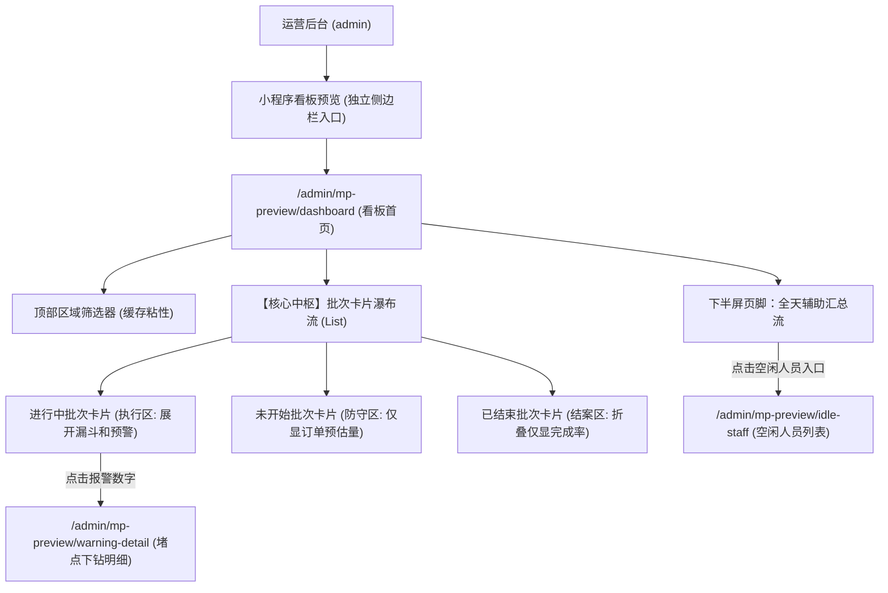
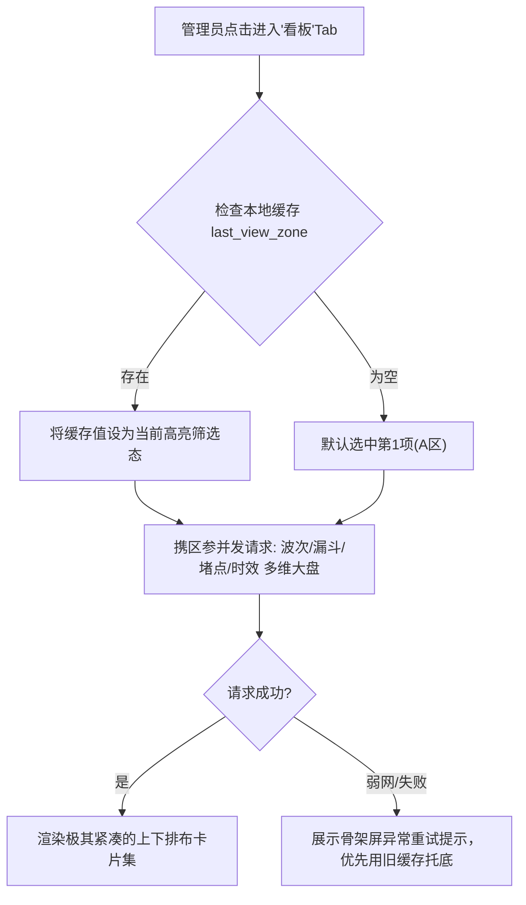
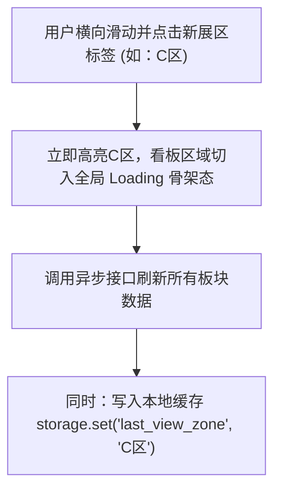

# 广交会项目 - 配送小程序管理看板 信息架构（IA）

> 版本：V0.1  
> 日期：2026-03-01  
> 模块：配送微信小程序 / 配送管理看板  
> 对应文档：`配送小程序_管理看板/PRD.md`、`配送小程序_管理看板/Spec.md`

## 1. 目标与边界

### 1.1 目标

1. 明确小程序端“配送管理看板”的界面层级与信息流转传递关系。
2. 指导在现存 Admin 后台中模拟实现高保真原型时的组件拆分。
3. 规范“区域切换与本地缓存”流的触发时机。

### 1.2 边界

1. 本 IA 仅聚焦于本次新增的单一页面：`管理看板 (Dashboard)`。
2. 假定入口由外部框架（如底部的自定 TabBar）提供。
3. 界面视觉基调明确继承自现网“悠饭配送”小程序，主打全屏白底/浅灰底，橙色（`#FF6600`等效）高亮，保持极高的视觉连续性。

## 2. 页面树与路由映射 (模拟版)

由于原型将在 Web 版 Admin 中呈现验证效果，故采用以下路由模拟：

## 3. 信息对象层（Information Objects）

| 对象 | 来源 | 主要使用模块 | 关键字段 / 维度 |
|---|---|---|---|
| 可管辖展区集合 AllowedZones | 字典/配置接口 | 顶部区域筛选器 | zoneId/zoneName |
| 批次聚合列表 BatchList | 大盘接口 | 瀑布流主轴 | 数组:`[BatchItem]`，每个Item代表一个送餐批次 |
| 批次单体 BatchItem | BatchList 元素 | 批次卡片 | batchId/batchName(如'11:30批次')/status(进行中/未开始)/isMidnight(是否宵夜动态批次) |
| 实时双层漏斗 Funnel | 批次内口径 | 进行中卡片 | 待接单/赴集散/在集散/送展位 等各段的【积压单量】，以及各环节挂载的【活跃承载人数】（配送员/分拣员个数） |
| 时效与流速仪 Velocity | 批次内口径 | 进行中/烂尾批次卡片 | warnings数组(出单/待接/集散/送展位四大核心超时) / 漏斗四段驻留耗时区间 / 实时清货流速(单/分)与清货倒计时 |
| 全天汇总盘 DailySummary | 全天统计接口 | 下半屏汇总 | totalDailyCount/onlineDeliveryStaff/onlineSignStaff，以及衍生算出的辅助决策【全局空闲待命兵力】 |

## 4. 关键任务流（Task Flow IA）

### 4.1 任务流：页面冷热启动与数据渲染

### 4.2 任务流：手动切换展区

## 5. 交互防呆与反馈架构

1. **下拉刷新 (Pull-to-Refresh)**：触发频率极高，需保证阻力柔和，释放后顶部有明确的 `Loading Spinner` 和“上次更新：HH:mm”文案。
2. **缺省兜底 (Empty State)**：当选中某个区域（如某偏僻馆），当前餐段真的一单都没有时，不要显示冰冷的“0”，而是展示插画：“当前区域暂无任务，履约非常通畅”。
3. **空间利用极限（折叠与横划）**：对于时效数据和排样榜单，必须用左右滑动卡片或是 `Tabs` 切换来防止页面过长导致失去焦点。
4. **弹性能量的抗折行防线（Responsive & Wrap-safe）**：作为高密度数据板，当遇上小屏 (360px) 与大数据极值（单量上万、人员破百）正面冲突时，必须从架构上引入 `flex-wrap` 自动下探以及防截断、核心词精简兜底策略。

## 6. 与现有系统组件的映射（仅用于 Admin 内验证）

在 Admin 代码库中开发验证版本时，建议新建独立目录：

- `src/views/mp-preview/DeliveryDashboard.vue` (大盘容器)
  - `components/ZoneFilterBar.vue` (横向滚动选择器)
  - `components/BatchCardRunning.vue` (进行中批次卡片：最重，加载漏斗与时效)
  - `components/BatchCardWaiting.vue` (未开始批次卡片：极简)
  - `components/BatchCardFinished.vue` (已结束批次卡片：极其扁平的锚点)
- `src/views/mp-preview/WarningDetail.vue` (下钻列表页面)
- `src/views/mp-preview/IdleStaffList.vue` (空闲人员列表页)
