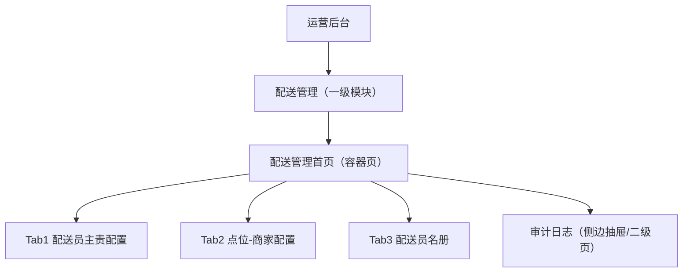
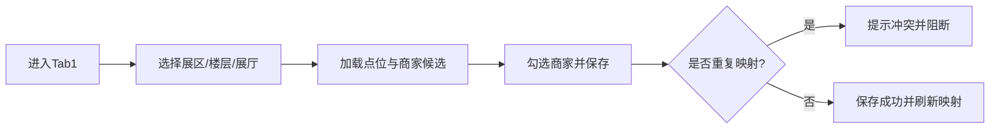
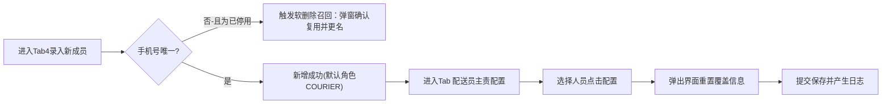
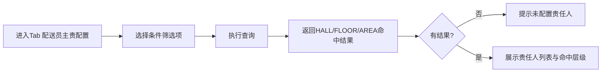

# 广交会项目 - 后台配送管理界面 信息架构（IA）

> 版本：V0.4（原型功能完全对齐版）  
> 日期：2026-03-01  
> 对应文档：`后台配送管理界面_PRD.md`、`后台配送管理界面_Spec.md`  
> 目标：为高保真原型提供页面清单、结构层级、路由与关键信息流

## 0. V0.4 原型对齐决策

1. 页面采用 3 个核心 Tab：`配送员主责配置`、`点位-商家配置`、`配送员名册`。不再采用查阅与配置同屏。
2. 引入独立组件用于角色的配置管理。
3. 默认 Tab 固定为第一个（`主责覆盖查阅`）。
4. 针对“点位-商家配置”，加固了筛选联动逻辑、排期提示感知与选单中商家的快捷检索信息流。

## 1. IA 目标与边界

### 1.1 目标

1. 明确后台配送管理子项目的页面全景与导航关系。
2. 明确每个页面承载的信息对象、操作动作、输入输出。
3. 让高保真原型可直接映射到前端路由与组件拆分。

### 1.2 边界

1. 本 IA 只覆盖“后台配送管理界面”。
2. 不覆盖“后台配送统计页”“配送小程序筛选模块”。
3. 不展开视觉规范（颜色、栅格、品牌样式），只定义信息结构与交互层级。

## 2. 页面树（Site Map）

## 3. 路由架构（Routing IA）

| 层级 | 页面ID | 建议路由 | 类型 | 说明 |
|---|---|---|---|---|
| L1 | delivery-management-home | `/admin/delivery-management` | 容器页 | 承载统一筛选与 4 个业务 Tab |
| L2 | responsibility-config-tab | `/admin/delivery-management/responsibility-config` | 功能页 | 批量选人及主责点位/商家查阅配置 |
| L2 | point-merchant-tab | `/admin/delivery-management/point-merchant` | 功能页 | 点位绑定商家 |
| L2 | staff-tab | `/admin/delivery-management/staff` | 功能页 | 配送员账号与角色管理 |
| L3 | audit-log-panel | `/admin/delivery-management/audit` | 辅助页/抽屉 | 变更追踪（P1） |

说明：
1. 原型可先做“单容器 + Tab 切换”，研发可按路由拆分。
2. `audit` 可先做抽屉态，后续再升为独立页面。

## 4. 导航与入口结构

### 4.1 全局导航位置

1. 左侧导航：`运营后台 > 配送管理`
2. 面包屑：`运营后台 / 配送管理`

### 4.2 页面内部导航

1. 顶部统一筛选条：展区 -> 楼层 -> 展厅（三级联动）
2. 中部功能导航：Tab 切换（3个核心页）
3. 右上辅助入口：`查看审计日志`

## 5. 页面清单（Page Inventory）

## P0-01 配送管理首页（容器）

- 页面目标：统一承载筛选上下文与功能 Tab。
- 核心信息：
1. 当前筛选条件（展区/楼层/展厅）
2. 快捷统计卡（可选，配置完成率/主责覆盖率）
- 核心动作：
1. 设置筛选上下文
2. 切换业务 Tab
- 产出影响：
1. 下游各 Tab 默认继承当前筛选条件

## P0-02 点位-商家配置（Tab1）

- 页面目标：维护点位与商家的多对多映射关系。
- 核心信息对象：
1. 顶层筛选域（展区/楼层，联动）及刚性排期提示文案
2. 全高铺展开流、无内生滚动条点位列表（含“操作”动作栏）
3. 候选商家关联库（自带快捷键入式信息流检索）
4. 当前映射对应展示（已绑定/未绑定）
- 核心动作：
1. 选择点位
2. 批量勾选商家并保存
3. 删除已有映射
- 关键反馈：
1. 去重提示（同一点位重复绑定商家）
2. 保存成功提示与差异预览

## P0-03 配送员名册（Tab4）

- 页面目标：维护配送员账号与角色身份。
- 核心信息对象：
1. 配送员列表（姓名、手机号、多角色标签、账号状态、最后变更线）
2. 筛选组（搜索输入、角色快筛、状态快筛）
3. 【新增成员】表单（手机号与姓名）
4. 【配置角色】集中弹窗：人员姓名正常文本展示；角色候选项重构为独立交互卡片，并明确附带说明文案（配送员：负责将餐品从商家配送到集散地... / 分拣签收员：负责在集散地签收餐品并按展厅分拣餐品 / 配送主管：负责关注配送）。
- 核心动作：
1. 录入新成员（自带默认角色 COURIER）
2. 停用账号（软删） / 恢复账号（包含重复检测原地激活）
3. 配置角色（互斥组合管理）
- 关键反馈：
1. 配置角色不合法（防空、防止互斥同存）时的阻断
2. 停用/恢复后的动态状态徽标变换

## P0-04 配送员主责配置（Tab1）

- 页面目标：极简清爽地按地理层级回溯责任人概况并支持主责分配的闭环界面。
- 核心信息对象：
1. 当前责任状态全高表格（姓名、手机号、状态、角色、主责展区/楼层/展厅、主责商家）
2. 顶部的全领域筛选检索（含区、层、点、商家名模糊搜索）
- 核心动作：
1. 依赖全局顶部下拉查询与响应。
2. 从列表左测打勾选取人员
3. 激活并点击面板浮层：【配置展厅点位】、【配置责任商家】执行统一覆盖
- 关键反馈：
1. 操作提交前的全景二次确认明细，弹窗不再需要层级推导提示。

## P1-06 审计日志（辅助页/抽屉）

- 页面目标：追踪配置变更，支持追责与回溯。
- 核心信息对象：
1. 操作人、时间、对象、变更前后
- 核心动作：
1. 按对象筛选日志
2. 查看详情快照

## 6. 信息对象层（Information Objects）

| 对象 | 来源 | 主要使用页面 | 关键字段 |
|---|---|---|---|
| 位置树 LocationTree | 字典接口 | 全页面 | areaCode/floorCode/hallId |
| 商家 Merchant | 商家接口 | 点位-商家配置 | merchantId/name/status |
| 点位商家映射 PointMerchantMap | 映射接口 | 点位-商家配置 | hallId + merchantId |
| 配送员 DeliveryStaff | 人员接口 | 配送员名册/配送员主责配置 | staffId/name/mobile/roles/status |
| 配送员角色 StaffRole | 关联或字段 | 配送员名册 | COURIER/SIGNER/SUPERVISOR |
| 主责范围 StaffScope | 主责接口 | 配送员主责配置 | scopeLevel/area/floor/hall/merchantIds |
| 审计日志 AuditLog | 日志接口 | 审计日志 | operator/before/after |

## 7. 关键任务流（Task Flow IA）

### 7.1 任务流A：点位绑定商家

### 7.2 任务流B：新增配送员并配置主责

### 7.3 任务流C：按条件查询主责人

## 8. 页面间数据与上下文传递

1. 顶部筛选条件为“全局上下文”，Tab 切换不清空。
2. 责任配置台保存后，当前责任状态区应可立即命中新配置（最终一致性不超过数秒）。
3. Tab1 配置变更后，需提示“影响下游排期商家可见范围”。

## 9. 状态与反馈架构（IA 级）

每个页面至少覆盖：
1. Loading（首次加载/提交中）
2. Empty（无数据）
3. Error（请求失败）
4. PermissionDenied（无权限）
5. Confirm（删除/覆盖提交二次确认）

## 10. 权限视角信息架构

| 角色 | 可见页面 | 可执行动作 |
|---|---|---|
| 超级管理员 | 全部 | 全部增删改查 + 日志 |
| 运营配置人员 | 各业务 Tab + 日志 | 点位映射、人员角色维护、责任范围覆盖 |
| 区长/主管 | 查询页 + 日志 | 人力查询、巡检 |

## 11. 原型交付映射建议

### 11.1 Figma/原型页命名建议

1. `DM-00_容器页`
2. `DM-01_配送员主责配置`
3. `DM-02_点位商家映射`
4. `DM-03_配送员名册`
5. `DM-04_审计日志抽屉`

### 11.2 与代码组件映射建议

1. `DeliveryManagementLayout`
2. `PointMerchantConfigPanel`
3. `DeliveryStaffPanel`
4. `ResponsibilityDeskPanel`
5. `AuditLogDrawer`

## 12. 待确认决策点（IA 冻结前）

1. `审计日志` 是抽屉态还是独立路由页。
2. `区长` 是否拥有“本区可编辑”权限。
3. Tab3 批量提交模式是否支持 `REPLACE`。
4. 首页是否展示“配置覆盖率”统计卡（如展示，需确定口径）。

## 13. IA 冻结标准（Definition of Ready）

满足以下条件即可进入高保真原型制作：
1. 页面树、路由、Tab 结构确认。
2. 5 个 P0 页面信息对象与关键动作确认。
3. 三条主任务流确认。
4. 权限架构与待确认项结论形成书面记录。
