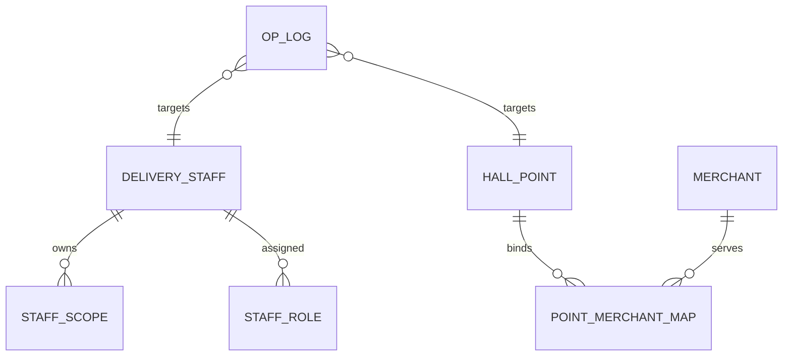
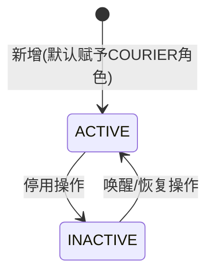

# 广交会项目 - 后台配送管理界面 技术规格说明（Spec，评审版）

> 版本：V0.4（原型功能完全对齐版）  
> 日期：2026-03-01  
> 对应 PRD：`后台配送管理界面_PRD.md`  
> 技术基座：Vue3 + Vite + JavaScript + Element Plus + Tailwind CSS

## 0. V0.4 原型对齐决策（路径A+B）

1. `责任配置台` 更新彻底移除了分离的配置和查询Tab，深度整合为单一的 `配送员主责配置` Tab。界面融合了范围查询、模糊商家过滤，以及多选配置操作。
2. 引入【配置角色】集中管理架构，支持 COURIER / SIGNER / SUPERVISOR 枚举及互斥校验逻辑（路径B）。名册内角色分配弹窗要求：人员姓名正常文本显示，**使用带副标题说明的优美卡片组件**供枚举单选/多选。
3. 人员管理全面支持软删：新增防重号覆盖机制，提供停用与恢复动作。
4. 表格展现支持角色快筛与账号状态过滤显示，并取消双层滚动条干扰；主责商家列剔除 `M001` 等预置 Mock，改用包含地区信息后缀的纯业务文字（如：`肯德基（A区）`），**并不再附加 `[A区]` 此类前置的区域标识模块**（由于暂未存强映射关系）。
5. 独立出来的“配送员主责配置”极大改善点位选取体验：取消所有树推导及层级继承警告。界面采用空间利用率极高的平铺阵列，所有层级楼层与展厅显性供勾选，彻底解决视觉与交互上的劣质体验。另外，明确约束【分拣签收员】角色不可选中参与主责范围指派。
6. 点位商家配置体验闭环优化：筛选器引入楼层联动，表格操作按交互标准升级组件，弹窗商家池提供即时输入框过滤检索。

## I. 页面基本信息

1. 页面 ID：`admin-delivery-management`
2. 所属模块：运营后台 / 配送管理
3. 建议路由：
   - `/admin/delivery-management/point-merchant`
   - `/admin/delivery-management/staff`
   - `/admin/delivery-management/responsibility-config` (合并了原本的desk/config)
4. 对应文档路径建议：
   - `/docs/pages/admin-delivery-management_spec.md`

## II. 业务背景与用户目标

1. 在高峰履约前，运营需快速完成“点位-商家-配送员主责范围”的配置闭环。
2. 区长需实时确认任一展区/楼层/展厅的主责任人是否完整。
3. 后台必须对“继承型主责规则”做确定性表达，避免执行歧义。

## III. 数据模型与字段定义

### 3.1 实体关系（ER）



### 3.2 字段定义

#### A. `delivery_staff`（配送员）

| 字段 | 类型 | 必填 | 说明 | 校验 |
|---|---|---|---|---|
| id | string | Y | 主键 | UUID |
| name | string | Y | 姓名 | 1-20 字符 |
| mobile | string | Y | 手机号 | 中国大陆手机号 + 逻辑唯一 |
| roles | array | Y | 角色集合 | Enum: `COURIER, SIGNER, SUPERVISOR`；需符合互斥与必填规则 |
| status | enum | Y | `ACTIVE/INACTIVE` | 默认 `ACTIVE` (软删使用 INACTIVE) |
| createdAt | datetime | Y | 创建时间 | 系统生成 |
| updatedAt | datetime | Y | 更新时间 | 系统生成 |

#### B. `staff_scope`（主责范围）

| 字段 | 类型 | 必填 | 说明 | 校验 |
|---|---|---|---|---|
| id | string | Y | 主键 | UUID |
| staffId | string | Y | 配送员 ID | 外键 |
| areaCode | string | Y | 展区编码 | 必须存在于字典 |
| floorCode | string | N | 楼层编码 | 若有需属于 area |
| hallId | string | N | 展厅 ID | 若有需属于 floor |
| scopeLevel | enum | Y | `AREA/FLOOR/HALL` | 由选择结果自动推导 |
| isPrimary | bool | Y | 主责标记 | 当前固定 true |
| createdAt | datetime | Y | 创建时间 | 系统生成 |

#### C. `point_merchant_map`（点位商家映射）

| 字段 | 类型 | 必填 | 说明 | 校验 |
|---|---|---|---|---|
| id | string | Y | 主键 | UUID |
| areaCode | string | Y | 展区编码 | 必须合法 |
| floorCode | string | Y | 楼层编码 | 必须合法 |
| hallId | string | Y | 展厅 ID | 必须合法 |
| merchantId | string | Y | 商家 ID | 必须合法 |
| status | enum | Y | `ACTIVE/INACTIVE` | 默认 `ACTIVE` |
| createdAt | datetime | Y | 创建时间 | 系统生成 |

唯一约束：
1. `delivery_staff.mobile` 唯一。
2. `point_merchant_map(hall_id, merchant_id)` 唯一。
3. `staff_scope(staff_id, area_code, floor_code, hall_id, scope_level)` 唯一。

## IV. 状态机与业务逻辑

### 4.1 配送员账号状态机



### 4.2 主责范围生成逻辑

规则输入：`areas[] + floorsByArea + hallsByFloor`

输出逻辑：
1. 仅选 `area`，生成 `scopeLevel=AREA`。
2. 选 `area + floor` 且该 floor 未选 hall，生成 `scopeLevel=FLOOR`。
3. 选 `area + floor + hall`，生成 `scopeLevel=HALL`。
4. 同一 staff 的重复作用域记录不重复写入。

### 4.3 查询命中逻辑

1. 条件到 `hall`：
   - 命中 `HALL(area,floor,hall)`
   - 命中 `FLOOR(area,floor)`
   - 命中 `AREA(area)`
2. 条件到 `floor`：
   - 命中 `FLOOR(area,floor)`
   - 命中 `AREA(area)`
3. 条件仅 `area`：
   - 命中 `AREA(area)`

返回时增加字段 `matchedBy = AREA/FLOOR/HALL`。

## V. 接口契约

### 5.1 字典与基础数据

1. `GET /api/admin/delivery/location-tree`
2. `GET /api/admin/delivery/merchants?areaCode=&floorCode=&hallId=`

### 5.2 点位商家映射

1. `GET /api/admin/delivery/point-merchant-maps`
2. `POST /api/admin/delivery/point-merchant-maps/batch-upsert`
3. `DELETE /api/admin/delivery/point-merchant-maps/{id}`

`batch-upsert` 请求示例：

```json
{
  "operatorId": "op_001",
  "items": [
    { "areaCode": "A", "floorCode": "1F", "hallId": "hall_8_0", "merchantId": "m_101" },
    { "areaCode": "A", "floorCode": "1F", "hallId": "hall_8_0", "merchantId": "m_102" }
  ]
}
```

### 5.3 配送员账号

1. `GET /api/admin/delivery/staff?pageNo=&pageSize=&keyword=&role=&status=`
2. `POST /api/admin/delivery/staff`
3. `PATCH /api/admin/delivery/staff/{staffId}/roles`
4. `PATCH /api/admin/delivery/staff/{staffId}/status`

`POST /staff` 请求示例：

```json
{
  "name": "张三",
  "mobile": "13800138000"
}
```

注意：不再接受 DELETE，改用 `PATCH status` 为 `INACTIVE`。如遇已存在且 `INACTIVE` 的 mobile 尝试 POST，视为静默合并。

`PATCH /roles` 请求示例：

```json
{
  "roles": ["COURIER", "SUPERVISOR"]
}
```

冲突返回：

```json
{
  "code": "MOBILE_DUPLICATED",
  "message": "手机号已存在，请检查后重试"
}
```

### 5.4 主责范围配置与查询

1. `POST /api/admin/delivery/staff-scopes/batch-upsert`
2. `GET /api/admin/delivery/staff-scopes?staffId=`
3. `GET /api/admin/delivery/staff-scope-query?areaCode=&floorCode=&hallId=`

`batch-upsert` 请求示例：

```json
{
  "mode": "APPEND",
  "staffIds": ["s_001", "s_002"],
  "scopes": [
    { "areaCode": "A" },
    { "areaCode": "B", "floorCode": "2F" },
    { "areaCode": "D", "floorCode": "1F", "hallId": "hall_20_1" }
  ]
}
```

查询返回示例：

```json
{
  "total": 2,
  "items": [
    {
      "staffId": "s_001",
      "staffName": "张三",
      "mobile": "138****8000",
      "matchedBy": "FLOOR",
      "areaCode": "A",
      "floorCode": "1F",
      "hallId": null
    }
  ]
}
```

### 5.5 审计日志

1. `GET /api/admin/delivery/audit-logs?bizType=&bizId=&pageNo=&pageSize=`

记录内容至少包含：
1. 操作人
2. 操作时间
3. 操作对象
4. 变更前后快照
5. 终端来源

## VI. 交互效果与状态处理

### 6.1 页面结构建议（高保真原型）

1. 顶部：统一筛选区（展区/楼层/展厅）。
2. 中部：Tab 内容区。
3. 右下角：技术规格悬浮入口（对齐通用原型规范）。

Tab 设计：
1. `点位商家配置`
2. `配送员管理/名册`
3. `配送员主责配置` (聚合列表查询、快速过滤、批量配置弹窗等功能)

### 6.2 核心交互细节

1. 三层筛选器：
   - 选展区后加载楼层；
   - 选楼层后加载展厅；
   - 反选上级自动清空下级。
2. `配送员主责配置` 交互：
   - 主体区 100% 宽度显示配送数据（包含：主责展厅点位、主责商家及角色）。结合顶部多维条件进行列表级过滤；
   - 操作逻辑提权：勾选记录后激活【配置展厅点位】、【配置责任商家】按钮，弹窗执行批量修改；
   - 点位弹窗：全新重构的空间利用界面。全部展区/楼层/展厅节点“平铺显性化排列”。去除了查阅/告警等任何继承文案提示。
3. 角色配置互斥与说明卡：
   - 【配送员】副标题：“负责将餐品从商家配送到集散地，从集散地配送到展位”；
   - 【分拣签收员】副标题：“负责在集散地签收餐品并按展厅分拣餐品”；与【配送员】绝对互斥，提交时强行阻断；同时此类人员在主责配置页不可用。
   - 【配送主管】副标题：“负责关注配送”；
   - 角色数组 `length >= 1`，不可为空。 
4. 配置提交二次确认：
   - 弹窗展示影响配送员数量；
   - 展示覆盖展厅数量；
   - 展示新增责任记录数量。
4. 删除动作：
   - 二次确认；
   - 删除后列表即时刷新。
5. 点位商家配置Tab特需交互：
   - 检索与提示：“过滤展区”文案统一为“筛选展区”，追加楼层与展区的筛选联动。旁边固定展示提示语：“此处展厅点位排期仅能选择此处配置的对应商家。”
   - 列表视图：取消表格局部滚动条（由页面统一流式拉伸）；操作列表头重命名为“操作”，内部操作映射按钮改为“配置”，组件样式需优化不能形似单薄窄按钮。
   - 绑定弹窗：当前选中点位名称需正常正常普通呈现（不得采用禁用输入框的诡异样式）；由于全部候选商家可能触及50家边界，在选单前端支持挂载输入框快捷查询机制（例如键入“A区”能即刻匹配出带A区的商家集合）。候选列表商家名称前方**摒弃类似 `[A区]` 这样的分类前缀**显示。

### 6.3 页面状态覆盖

1. Loading：字典、列表、保存按钮独立 loading 状态。
2. Empty：无数据时展示引导文案与快捷操作按钮。
3. Error：接口失败时支持重试。
4. PermissionDenied：无权限用户只读或不可见。

## VII. 边界条件与降级策略

1. 字典接口失败：保留上次缓存快照，只允许查询，不允许提交新配置。
2. 并发写冲突：后端按版本号或更新时间做乐观锁，冲突提示“配置已被他人更新”。
3. 批量配置过大：单次最多 200 人、2000 条 scope，超限分批提交。
4. 手机号格式非法：前端即时校验 + 后端兜底。
5. 展厅下线/重命名：保留历史 scope 快照并标记“字典失效”。

## VIII. E2E 验收用例（Given/When/Then）

1. Given 新手机号未注册，When 运营新增配送员，Then 创建成功并出现在列表首行。
2. Given 手机号已存在，When 再次提交新增，Then 返回重复错误且不落库。
3. Given 选择“展区A”未选楼层展厅，When 批量配置给 2 名配送员，Then 两人均生成 `AREA(A)` 作用域。
4. Given 选择“展区A + 1F”未选展厅，When 保存，Then 生成 `FLOOR(A,1F)` 作用域。
5. Given 查询条件为“展区A-1F-8.0展厅”，When 执行查询，Then 结果包含 `HALL/FLOOR/AREA` 三类命中记录。
6. Given 点位已绑定商家M1，When 再次绑定相同商家，Then 被系统拦截并提示重复。
7. Given 删除配送员，When 在审计日志页查询该账号，Then 可看到删除操作记录与操作人。

## IX. 待确认事项 / 开发备注

1. `batch-upsert` 的 `mode` 是否固定 `APPEND`，还是支持 `REPLACE`。
2. 区长角色的写权限范围是否限制为“本区可编辑、跨区只读”。
3. 点位商家映射是否需要“生效时间区间”字段。
4. 是否允许删除带有活跃主责范围的配送员（建议先禁用再清理）。

## X. 原型实现建议（Vue3 + Element Plus）

1. 组件建议：
   - `DeliveryPointMerchantTab.vue`
   - `DeliveryStaffTab.vue`
   - `ResponsibilityConfigTab.vue` (主责配置聚合页)
   - `ConfigHallDialog.vue` / `ConfigMerchantDialog.vue`
2. 状态管理：
   - `useDeliveryManagementStore` 统一管理字典、列表和筛选状态。
3. 文档渲染：
   - 按通用规范接入页面级 Spec 抽屉，支持 Markdown 展示。
