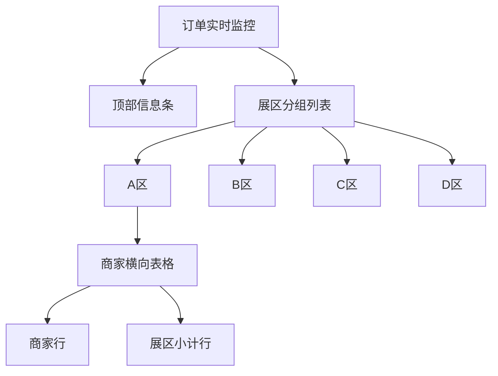
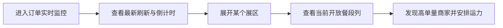

# 配送管理 - 订单实时监控 IA

> 版本：V0.1  
> 日期：2026-04-09

## 1. 页面定位

配送管理模块下的独立 Tab 页面，用于在截单前观察各展区、各商家的实时订单情况。

## 2. 信息架构

## 3. 信息层级

1. 一级信息：当前开放餐段所在列。
2. 二级信息：各商家订单数。
3. 三级信息：餐品份数、变化高亮、小计。

## 4. 核心任务流

## 5. 关键交互

1. 展区支持折叠/展开。
2. 表格列固定按截单时段排序。
3. 顶部仅保留刷新相关信息。
4. 原型态允许通过“演示时间”验证不同时间点场景。
