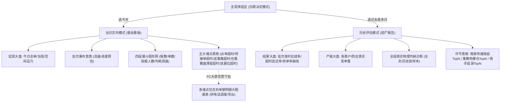

# 广交会项目 - 后台配送统计页 信息架构（IA）

> 版本：V0.2  
> 日期：2026-03-01

## 1. 页面清单

1. `DS-01` PC端配送统计主页面（单页支持双轨视图：实时督战 / 历史复盘）
2. `DS-02` Top堵点大基表视图（PC端扩展组件，支持快速导出当前聚合明细）
3. `DS-03` 空闲运力电话簿抽屉（组件态）

## 2. 页面分区 (双轨引擎驱动)

## 3. 信息层级

1. **总揽层**：全局单量、宏观大盘（运力/死单率/准时波动率）。
2. **流水层**：批次流速测算（进行中进度）、四段漏斗分流（目前堆积的袋数和人数 / 历史沉淀的漏斗耗时）。
3. **报警与归因层**：当日的五大实时超时排行榜 / 历史模式下的各方违规超时率黑榜。

## 4. 任务流操作

1. **前线指挥（今日督战）**：大区长筛选“今天”，盯着页面中心的“四段漏斗阻塞点”和底部的“五大报警榜单”，一旦发现哪家商家出单爆点，点开旁边的明细基表，打出调度电话。
2. **总部复盘（昨天或多日大盘回溯）**：运营坐席筛选“昨天或上周区间”，页面变为统计折线和柱状图，直观查阅过去几天“B区集散滞留超时率”是否有改善趋势，不追问具体某个单去哪了。

## 5. IA 冻结点

1. **核心不拆分**：“当日动态”与“历史静态”必须共用同一入口，仅靠顶部“日期选择器”隐蔽切换渲染引擎流。
2. **逻辑对齐移动端**：状态字典依然固定为 5 段，漏斗强挂钩移动端原代码，坚守“1袋多单”的概念。
3. **摒弃无意义深钻**：在“历史复盘模式”中，全面干掉针对单据号级别的单号反查，仅提供统计学意义上的图表与占比数字。
