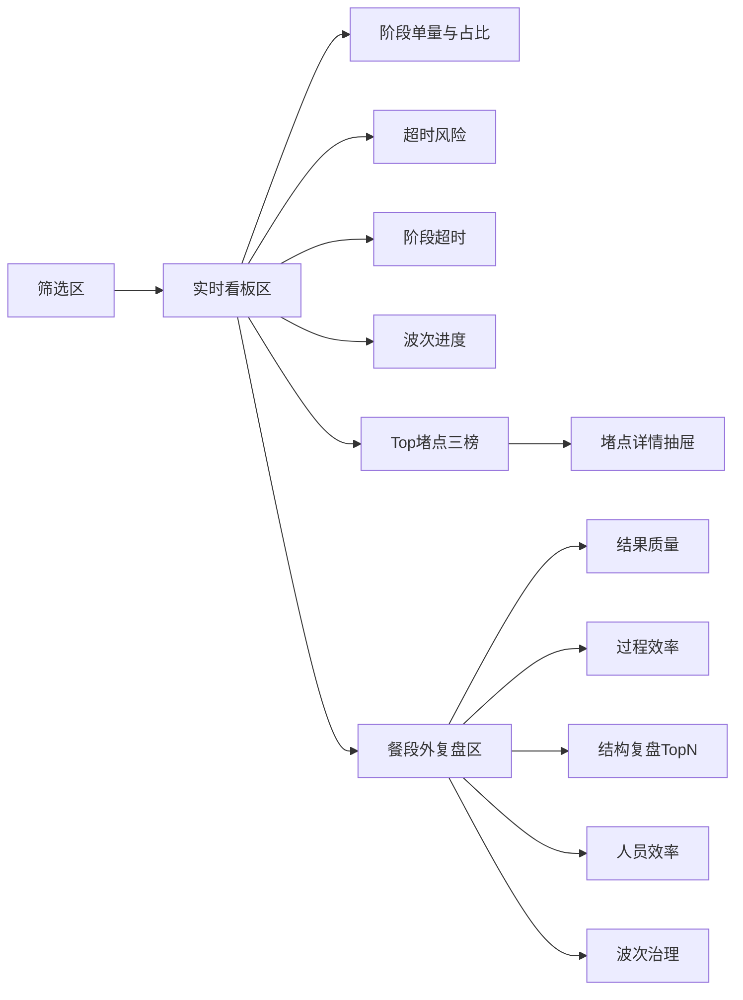

# 广交会项目 - 后台配送统计页 信息架构（IA）

> 版本：V0.2  
> 日期：2026-03-01

## 1. 页面清单

1. `DS-01` 配送统计主页面（单页）
2. `DS-02` Top堵点详情抽屉（组件态）
3. `DS-03` 指标口径说明抽屉（组件态，可选）

## 2. 页面分区

## 3. 信息层级

1. 一级信息（决策层）：波次完成率、超时未送达率、超时送达率。
2. 二级信息（诊断层）：阶段超时率、Top堵点三榜、阶段时长P90。
3. 三级信息（执行层）：商家/展厅/配送员维度明细与排序。

## 4. 任务流

1. 配送主管筛选日期、餐段、展区/楼层/展厅。
2. 先看实时看板判断是否存在阶段超时和波次风险。
3. 点击Top堵点查看商家或展厅明细并进行现场调度。
4. 餐段结束后切换昨日/前日，查看复盘指标并确认改进重点。

## 5. IA 冻结点

1. 状态字典固定为 5 段（待接单/赴集散/在集散/送展位/已送达）。
2. 阶段超时阈值固定为 10/10/10/25。
3. Top堵点窗口固定为最近15分钟，排序规则固定。
4. 复盘区指标固定为“结果质量/过程效率/结构复盘/人员效率/波次治理”五组。
