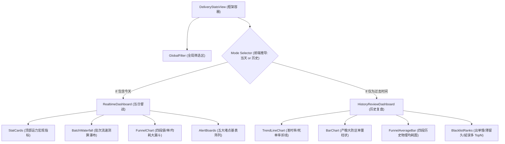

# 广交会项目 - 后台配送统计页 技术规格说明（Spec）

> 版本：V0.2  
> 日期：2026-03-01

## 1. 页面结构 (双轨显示引擎)



## 2. 数据模型

### 2.1 `delivery_realtime_snapshot` (当日大盘快照)

| 字段 | 类型 | 说明 |
|---|---|---|
| statDate | string | 统计日期 (YYYY-MM-DD) |
| todayTotalOrders | number | 今日总下单量 |
| activeDeliveryStaff | number | 当班活跃配送员 (宽口径去重) |
| activeSorterStaff | number | 当班活跃分拣签收员 (宽口径去重) |
| idleDeliveryStaff | number | 当前空闲配送员基数 |
| idleSorterStaff | number | 当前空闲分拣签收员基数 |

### 2.2 `delivery_batch_progress` (当日批次流速测算)

| 字段 | 类型 | 说明 |
|---|---|---|
| batchId | string | 批次标识 (如 0915_1000) |
| batchName | string | 批次显示名 (09:15~10:00) |
| batchStatus | string | 状态 (PENDING/PROCESS/OVERTIME/FINISHED) |
| orderTotal | number | 需配送总单量 |
| orderDelivered | number | 已送达单量 |
| deliverySpeed | number | 近5分钟送达流速 (单/分, `0`或`-1`表未知) |
| estimatedRestMinutes | number | 预估送完还需分钟数 |

### 2.3 `delivery_funnel_node` (漏斗节点测速)

| 字段 | 类型 | 说明 |
|---|---|---|
| stage | string | PENDING / TO_HUB / IN_HUB / DELIVERING |
| bagCount | number | 物理袋数 |
| orderCount | number | 逻辑单数 |
| distinctStaffs | number | 当前挂载实操活体人数 |
| avgMinutes | number | 实时测算均耗 (近30分钟样本值) |

### 2.4 `delivery_bottleneck_item`

| 字段 | 类型 | 说明 |
|---|---|---|
| boardType | string | 榜单类型（出单超时/待接单超时/送集散地超时/在集散地滞留超时/送展位超时） |
| targetId | string | 商家ID或展厅ID |
| targetName | string | 商家名或展厅名 |
| overtimeOrderCount | number | 超时单量 |
| oldestOvertimeMinutes | number | 最老超时时长 |
| windowStart | datetime | 窗口开始时间 |
| windowEnd | datetime | 窗口结束时间 |

### 2.5 `history_review_trend` (历史定局：按天趋势线)

| 字段 | 类型 | 说明 |
|---|---|---|
| statDate | string | 汇算日期 |
| ontimeDeliveryRate | number | 批次准时送达达成率 |
| overtimeDeliveredRate | number | 瑕疵成功（超时送达）率 |
| deadOrderRate | number | 死单（超时且终未送达）率 |
| areaTopYield | array | 产粮防区排行 (大体量区展示) |

### 2.6 `history_stage_duration_avg` (历史定局：均耗测定)

| 字段 | 类型 | 说明 |
|---|---|---|
| statDate | string | 汇算日期 |
| stage | string | 阶段 (PENDING/TO_HUB...) |
| realAvgMinutes | number | 跑通流程的真实物理日均耗 |
| p90Minutes | number | P90尾部极差耗时 |

### 2.7 `history_blacklists` (历史归因：违规大户)

| 字段 | 类型 | 说明 |
|---|---|---|
| listType | string | 榜单类型 (出单超时/待接拖单/集散爆仓/末端延误) |
| targetName | string | 商家名/展区名/人名 |
| delayOrders | number | 发生超时的单均积压量 |
| delayRatio | number | 延误在自身盘子中的占比 (找出真毒瘤) |

## 3. 指标计算口径

1. 阶段占比 = 阶段单量 / 当前餐段总单量。
2. 超时未送达占比 = 超时未送达单量 / 当前餐段总单量。
3. 超时送达占比 = 超时送达单量 / 已送达单量。
4. 阶段超时占比 = 阶段超时单量 / 阶段当前单量。
5. 波次完成率 = 当前波次已送达单量 / 当前波次总单量。
6. 波次剩余单量 = 当前波次总单量 - 当前波次已送达单量。
7. Top堵点排序 = `overtimeOrderCount DESC, oldestOvertimeMinutes DESC`。

## 4. 接口契约 (分离双轨)

**当日实时图谱 API:**
1. `GET /api/admin/delivery/stats/realtime/snapshot` (大盘与运力顶卡)
2. `GET /api/admin/delivery/stats/realtime/batches` (批次流速库)
3. `GET /api/admin/delivery/stats/realtime/funnel` (四段大漏斗节点)
4. `GET /api/admin/delivery/stats/realtime/alerts` (五大红黑警报表)
   *- (PC强扩支持导出单表明细)* `GET /api/admin/delivery/stats/realtime/alerts/export` 

**历史验尸报表 API:**
5. `GET /api/admin/delivery/stats/history/trend-line` (跨日或日级达成率走势)
6. `GET /api/admin/delivery/stats/history/duration-bars` (历史均耗沉淀柱状图)
7. `GET /api/admin/delivery/stats/history/blacklists` (归因溯源违规大户 TopN)

公共请求参数：

```json
{
  "date": "2026-03-01",
  "areaCode": "A",
  "floorCode": "1F",
  "hallId": "hall_8_0",
  "staffId": "s_001",
  "mealSlot": "LUNCH",
  "orderStatus": "IN_HUB",
  "windowMinutes": 15
}
```

## 5. 状态与阈值字典

1. 状态字典（5段）：
   - `PENDING` 待接单
   - `TO_HUB` 赴集散
   - `IN_HUB` 在集散
   - `DELIVERING` 送展位
   - `DELIVERED` 已送达
2. 阶段阈值：
   - 待接单： >= 10 分钟
   - 赴集散： >= 8 分钟
   - 在集散： >= 7 分钟
   - 送展位： >= 25 分钟
   - 出单超时（宵夜）： >= 30 分钟

## 6. 交互状态

1. Loading：首次加载与筛选提交中。
2. Empty：无结果时显示引导。
3. Error：接口失败时支持重试。
4. DrillDownLoading：点击Top堵点后详情加载中。

## 7. E2E 用例验证 (前端黑盒)

1. **场景：系统挂载判定（默认模式）** 
   - 行为：大区长默认登入页面（日期默认为当日）。
   - 预期结果：此时渲染树激活 `<RealtimeDashboard>` 组件族，页面可见跳动的红灯及测速秒表。历史组件折线图不予初始化。
2. **场景：历史数据探查（无单据透传）**
   - 行为：运营人员将全局日期选择框选至上周整周域。
   - 预期结果：前端引擎判定无“今天”成分，挂载 `<HistoryReviewDashboard>`，所有实时秒表灭火，页面纯净渲染 T+1 算完的大盘指标和柱状均耗对比。点击柱子**不允许**弹出几十万历史订单明细（仅限看防区归属）。
3. **场景：突发报警现场打压（PC下钻）**
   - 行为：在“当日模式”下的“送展位超时大屏榜单”，点击某排名第一的站长。
   - 预期结果：展开 `AlertBoardDetails` 表格组件，精确打出该张长名下的正在超时的那几袋货标与单号，并可用一键导出或电话直通的方式干预。
