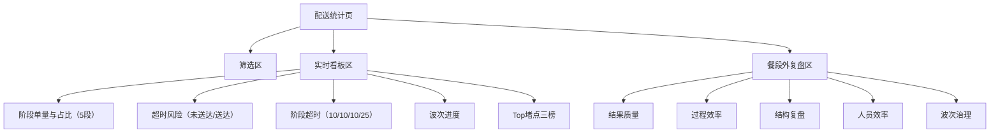

# 广交会项目 - 后台配送统计页 技术规格说明（Spec）

> 版本：V0.2  
> 日期：2026-03-01

## 1. 页面结构



## 2. 数据模型

### 2.1 `delivery_realtime_snapshot`

| 字段 | 类型 | 说明 |
|---|---|---|
| statDate | string | 统计日期 |
| mealSlot | string | 餐段 |
| areaCode | string | 展区 |
| floorCode | string | 楼层 |
| hallId | string | 展厅 |
| totalOrders | number | 当前餐段总单量 |
| pendingOrders | number | 待接单量 |
| toHubOrders | number | 赴集散单量 |
| inHubOrders | number | 在集散单量 |
| deliverOrders | number | 送展位单量 |
| deliveredOrders | number | 已送达单量 |
| overtimeUndeliveredOrders | number | 超时未送达单量 |
| overtimeDeliveredOrders | number | 超时送达单量 |
| currentWaveTotalOrders | number | 当前波次总单量 |
| currentWaveDeliveredOrders | number | 当前波次已送达单量 |
| currentWaveRemainingOrders | number | 当前波次剩余单量 |

### 2.2 `delivery_stage_overtime_bucket`

| 字段 | 类型 | 说明 |
|---|---|---|
| stage | string | 阶段（PENDING/TO_HUB/IN_HUB/DELIVERING） |
| thresholdMinutes | number | 超时阈值（10/10/10/25） |
| stageOrderCount | number | 当前阶段单量 |
| overtimeOrderCount | number | 当前阶段超时单量 |
| overtimeRate | number | 超时占比 |

### 2.3 `delivery_wave_progress`

| 字段 | 类型 | 说明 |
|---|---|---|
| waveId | string | 波次ID |
| waveTotalOrders | number | 波次总单量 |
| waveDeliveredOrders | number | 波次已送达量 |
| waveCompletionRate | number | 波次完成率 |
| waveRemainingOrders | number | 波次剩余单量 |

### 2.4 `delivery_bottleneck_item`

| 字段 | 类型 | 说明 |
|---|---|---|
| boardType | string | 榜单类型（MERCHANT_PENDING/HALL_IN_HUB/HALL_DELIVERING） |
| targetId | string | 商家ID或展厅ID |
| targetName | string | 商家名或展厅名 |
| overtimeOrderCount | number | 超时单量 |
| oldestOvertimeMinutes | number | 最老超时时长 |
| windowStart | datetime | 窗口开始时间 |
| windowEnd | datetime | 窗口结束时间 |

### 2.5 `delivery_review_summary`

| 字段 | 类型 | 说明 |
|---|---|---|
| statDate | string | 统计日期 |
| mealSlot | string | 餐段 |
| dueOrders | number | 应送达单量 |
| deliveredOrders | number | 已送达单量 |
| ontimeDeliveredOrders | number | 准时送达单量 |
| overtimeDeliveredOrders | number | 超时送达单量 |
| overtimeUndeliveredOrders | number | 超时未送达单量 |
| waveClosePassRate | number | 波次关账一次通过率 |

### 2.6 `delivery_stage_duration_stat`

| 字段 | 类型 | 说明 |
|---|---|---|
| stage | string | 阶段 |
| avgMinutes | number | 均值时长 |
| p90Minutes | number | P90时长 |
| sampleSize | number | 样本量 |

### 2.7 `delivery_efficiency_staff`

| 字段 | 类型 | 说明 |
|---|---|---|
| staffId | string | 配送员ID |
| staffName | string | 配送员姓名 |
| deliveredOrders | number | 已送达单量 |
| ontimeDeliveredOrders | number | 准时送达单量 |
| ontimeRate | number | 准时送达率 |

## 3. 指标计算口径

1. 阶段占比 = 阶段单量 / 当前餐段总单量。
2. 超时未送达占比 = 超时未送达单量 / 当前餐段总单量。
3. 超时送达占比 = 超时送达单量 / 已送达单量。
4. 阶段超时占比 = 阶段超时单量 / 阶段当前单量。
5. 波次完成率 = 当前波次已送达单量 / 当前波次总单量。
6. 波次剩余单量 = 当前波次总单量 - 当前波次已送达单量。
7. Top堵点排序 = `overtimeOrderCount DESC, oldestOvertimeMinutes DESC`。

## 4. 接口契约

1. `GET /api/admin/delivery/stats/realtime-overview`
2. `GET /api/admin/delivery/stats/stage-overtime`
3. `GET /api/admin/delivery/stats/wave-progress`
4. `GET /api/admin/delivery/stats/top-bottlenecks`
5. `GET /api/admin/delivery/stats/review-summary`
6. `GET /api/admin/delivery/stats/stage-duration`
7. `GET /api/admin/delivery/stats/merchant-overtime-topn`
8. `GET /api/admin/delivery/stats/hall-overtime-topn`
9. `GET /api/admin/delivery/stats/staff-efficiency`

公共请求参数：

```json
{
  "date": "2026-03-01",
  "areaCode": "A",
  "floorCode": "1F",
  "hallId": "hall_8_0",
  "staffId": "s_001",
  "mealSlot": "LUNCH",
  "orderStatus": "IN_HUB",
  "windowMinutes": 15
}
```

## 5. 状态与阈值字典

1. 状态字典（5段）：
   - `PENDING` 待接单
   - `TO_HUB` 赴集散
   - `IN_HUB` 在集散
   - `DELIVERING` 送展位
   - `DELIVERED` 已送达
2. 阶段阈值：
   - `PENDING` >= 10 分钟
   - `TO_HUB` >= 10 分钟
   - `IN_HUB` >= 10 分钟
   - `DELIVERING` >= 25 分钟

## 6. 交互状态

1. Loading：首次加载与筛选提交中。
2. Empty：无结果时显示引导。
3. Error：接口失败时支持重试。
4. DrillDownLoading：点击Top堵点后详情加载中。

## 7. E2E 用例

1. Given 默认进入页面，When 不筛选，Then 展示“今日+全区”的实时看板数据。
2. Given 选择展区与餐段，When 点击查询，Then 阶段分布、阶段超时、波次进度同步刷新。
3. Given 存在堵点，When 查看Top堵点，Then 按“超时单量+最老超时时长”排序正确。
4. Given 选择昨日数据，When 查询，Then 展示复盘指标（结果质量、阶段时长、TopN、人效）。
5. Given 无数据，When 查询，Then 展示空态而非报错。
