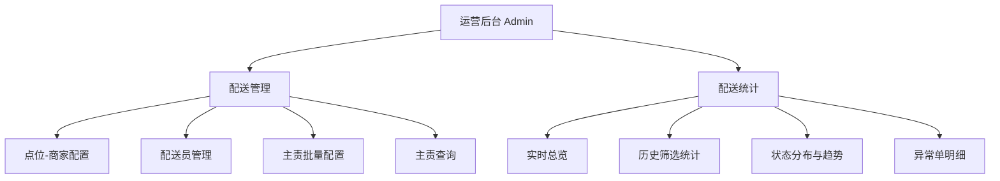

# 广交会项目 - 运营后台 信息架构（IA）

> 版本：V0.1  
> 日期：2026-02-28

## 1. 站点地图

## 2. 页面层级

| 层级 | 页面ID | 路由 | 说明 |
|---|---|---|---|
| L1 | admin-shell | `/admin` | 运营后台容器 |
| L2 | delivery-management | `/admin/delivery-management` | 配送管理模块 |
| L2 | delivery-stats | `/admin/delivery-stats` | 配送统计模块 |

## 3. 导航结构

1. 左侧导航：模块切换（配送管理、配送统计）
2. 顶部栏：项目标题、当前时间、角色标签
3. 内容区：模块页面主体
4. 右下角：文档查看悬浮入口

## 4. 关键任务流

### 4.1 配置任务流

1. 进入配送管理
2. 配置点位商家
3. 新增配送员
4. 配置主责范围
5. 查询验证结果

### 4.2 监控任务流

1. 进入配送统计
2. 设置筛选条件
3. 查看实时指标与状态分布
4. 定位异常单并导出

## 5. 信息对象

1. `LocationTree`
2. `Merchant`
3. `DeliveryStaff`
4. `StaffScope`
5. `DeliveryOrderStat`
6. `DeliveryExceptionItem`

## 6. IA 冻结标准

1. 两个模块页面清单与入口固定。
2. 模块内关键任务流可闭环。
3. 公共筛选与状态反馈结构固定。
