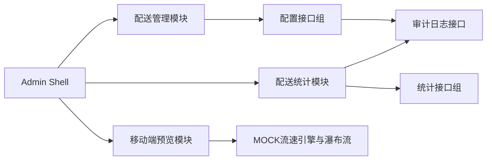

# 广交会项目 - 运营后台 技术规格说明（Spec，评审版）

> 版本：V0.1  
> 日期：2026-02-28  
> 技术栈：Vue3 + Vite + JavaScript + Element Plus + Tailwind CSS

## 1. 系统架构



## 2. 前端工程结构

```text
admin/
  src/
    layouts/
    modules/
      delivery-management/
      delivery-stats/
      mp-preview/
    components/
    router/
  docs/
    运营后台_PRD.md
    运营后台_Spec.md
    运营后台_IA.md
    modules/
      配送管理/
      配送统计/
      配送小程序_管理看板/
```

## 3. 路由规范

1. `/admin/delivery-management` (B端 PC操作)
2. `/admin/delivery-stats` (B端 PC图表)
3. `/admin/mp-preview/*` (移动端模拟预览容器，含 dashboard、warning、idle)

## 4. 跨模块公共能力

1. 统一筛选器模型：`areaCode/floorCode/hallId`
2. 统一状态组件：Loading、Empty、Error、PermissionDenied
3. 统一文档查看器：页面右下角“技术规格”入口，支持 Markdown + Mermaid
4. 统一审计入口：配置类动作统一记录

## 5. 数据契约（平台级）

### 5.1 公共字典

- `GET /api/admin/delivery/location-tree`

### 5.2 公共错误码

| code | 含义 |
|---|---|
| MOBILE_DUPLICATED | 手机号重复 |
| SCOPE_CONFLICT | 主责范围冲突 |
| INVALID_SCOPE | 非法层级关系 |
| STAT_FILTER_INVALID | 统计筛选参数错误 |

## 6. 性能与可用性要求

1. 页面首屏可交互时间：P95 <= 2.5s（原型阶段可放宽）。
2. 查询接口响应：P95 <= 800ms（原型使用 Mock 数据）。
3. 表格分页：默认 20 条/页，支持 50/100。

## 7. 安全与权限

1. 配置类操作必须具备写权限。
2. 删除与覆盖操作必须二次确认。
3. 只读角色不可见新增/删除/保存按钮。

## 8. 测试要点

1. 模块切换不丢失全局筛选上下文。
2. 配送管理配置后，查询结果可即时回显。
3. 配送统计筛选维度组合正确，状态口径一致。
4. 文档查看器可正确渲染 Mermaid 图。
